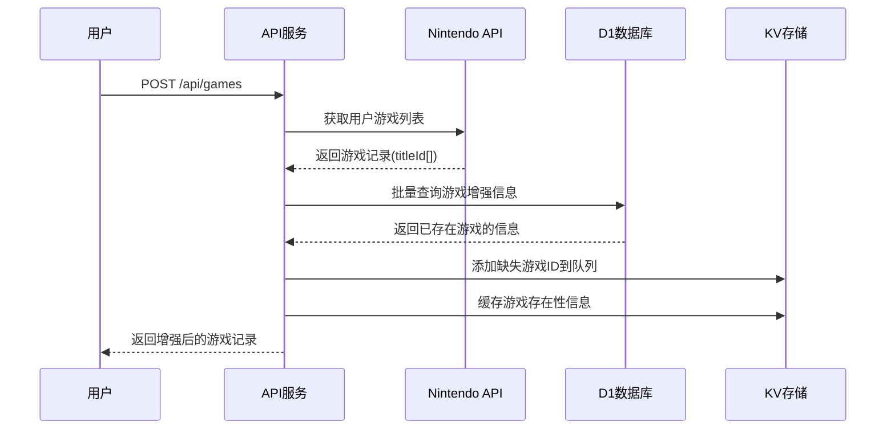

# KV 游戏 ID 管理系统设计文档

## 概述

本文档描述了基于 Cloudflare KV 和 D1 的智能游戏 ID 队列管理系统的设计。该系统实现了用户驱动的游戏数据采集闭环，通过智能去重和队列管理，提高数据采集效率并节省资源成本。

## 架构

### 整体架构设计

我们建立了一个智能的、去重的游戏数据管理系统，使用 KV 作为游戏 ID 的中央管理器，D1 作为游戏详细数据的存储，两个项目协同工作。

### 核心组件

1. **KVService**: 管理游戏 ID 队列和缓存
2. **DatabaseService**: 处理 D1 数据库操作和游戏记录增强
3. **Queue Handlers**: 提供队列管理的 API 接口

## 组件和接口

### KV 存储结构

#### GAME_IDS 命名空间
```
├── "pending:{titleId}" → { addedAt: timestamp, source: "user_query" }
├── "processing:{titleId}" → { startedAt: timestamp, attempts: 1 } (预留)
├── "completed:{titleId}" → { completedAt: timestamp } (预留)
└── "failed:{titleId}" → { lastAttempt: timestamp, error: "..." } (预留)
```

#### CACHE 命名空间
```
├── "db:exists:{titleId}" → "true"/"false" (TTL: 6小时)
├── "game:{titleId}" → 游戏详情缓存 (TTL: 1小时) (预留)
└── "user:{sessionId}:games" → 用户游戏记录缓存 (TTL: 10分钟) (预留)
```

### D1 数据库结构

#### games 表
- 存储完整的游戏元数据
- 关键字段：`title_id`, `formal_name`, `publisher_name`
- 用于游戏记录增强和存在性检查

#### scraping_stats 表
- 存储爬取统计信息
- 用于监控爬虫运行状态
## 数据模型

### GameRecord 增强模型
```typescript
interface GameRecord {
  titleId: string
  titleName: string
  titleNameCN?: string // 从 formal_name 映射
  publisher?: string // 从 publisher_name 映射
  deviceType: string
  imageUrl: string
  lastUpdatedAt: string
  firstPlayedAt: string
  lastPlayedAt: string
  totalPlayedDays: number
  totalPlayedMinutes: number
}
```

### KV 队列项模型
```typescript
interface QueueItem {
  addedAt: number
  source: 'user_query' | 'manual'
}
```

### 缓存模型
```typescript
interface GameExistsCache {
  titleId: string
  exists: boolean
  ttl: 21600 // 6小时
}
```

## 错误处理

### KV 操作错误
- 连接失败：返回空结果，不影响主流程
- 写入失败：记录错误日志，继续处理
- 读取失败：降级到数据库查询

### D1 数据库错误
- 查询失败：返回空的增强信息
- 连接超时：使用缓存数据或返回原始数据
- 语法错误：记录详细错误信息用于调试

### API 错误处理
- 400: 请求参数错误（如无效的游戏 ID 格式）
- 405: 请求方法不支持
- 500: 内部服务器错误

## 测试策略

### 单元测试
- KVService 的队列操作方法
- DatabaseService 的增强逻辑
- 去重机制的正确性

### 集成测试
- 完整的游戏记录增强流程
- 队列管理 API 的端到端测试
- 缓存机制的有效性验证

### 性能测试
- 批量游戏 ID 处理的性能
- 缓存命中率的监控
- KV 和 D1 的响应时间测试
## 工作流程设计

### 流程 1：用户查询游戏记录（API 项目）



### 流程 2：智能去重检查

1. **KV 层去重**：检查 `pending:{titleId}` 避免重复添加
2. **D1 层去重**：检查数据库中是否已存在游戏数据
3. **缓存层优化**：使用存在性缓存减少重复查询

### 流程 3：队列管理

- **添加操作**：自动去重，记录时间戳和来源
- **查询操作**：支持分页和限制数量
- **清理操作**：预留接口用于清理过期数据

## API 接口设计

### 现有接口增强

#### POST /api/games
- **增强功能**：智能队列管理和去重逻辑
- **返回数据**：包含中文名称和发行商信息的游戏记录

#### GET /api/stats
- **增强功能**：包含队列统计信息
- **返回数据**：总游戏数、中文名称覆盖率、队列状态

### 新增管理接口

#### GET /api/admin/queue/stats
```json
{
  "success": true,
  "stats": {
    "pendingCount": 15,
    "pendingGames": ["01007EF00011E000", "..."]
  }
}
```

#### POST /api/admin/queue/add
```json
{
  "titleIds": ["01007EF00011E000", "0100A3D008C5C000"]
}
```

## 性能优化策略

### 批量操作优化
- 使用 KV 的 `list()` 方法批量获取队列状态
- 使用 D1 的 `IN` 查询批量检查游戏存在性
- 使用 `Promise.all()` 并行处理缓存操作

### 缓存策略
- **存在性缓存**：6小时 TTL，减少重复数据库查询
- **批量缓存**：一次性缓存多个游戏的存在性信息
- **智能失效**：缓存未命中时自动更新

### 成本控制
- **KV 读写优化**：批量操作减少请求次数
- **D1 查询优化**：使用索引和批量查询
- **智能去重**：避免重复工作，节省资源

## 监控和维护

### 关键指标
- KV 读写次数和成本使用量
- D1 查询次数和响应时间
- 队列处理效率和去重命中率
- 系统错误率和可用性

### 运维功能
- 队列状态监控和告警
- 自动清理过期数据
- 性能指标收集和分析
- 错误日志聚合和分析

## 设计决策和理由

### 为什么选择 KV 作为队列存储？
- **高性能**：毫秒级读写延迟
- **全球分布**：边缘网络就近访问
- **成本效益**：免费额度足够使用
- **简单可靠**：无需复杂的队列管理

### 为什么使用三层去重机制？
- **KV 层**：快速过滤已在队列中的 ID
- **D1 层**：确保数据库中不存在才添加
- **缓存层**：减少重复的数据库查询

### 为什么选择 formal_name 字段？
- **数据一致性**：与爬虫项目的数据结构保持一致
- **字段语义**：formal_name 更准确地表示正式名称
- **向后兼容**：通过映射保持 API 接口不变
